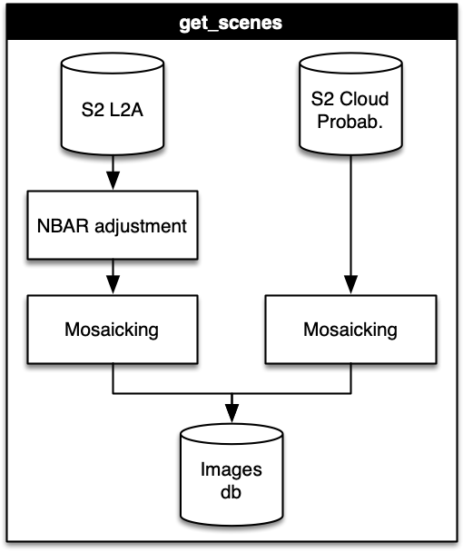

# Code repository

## MSc thesis "*Crop Classification with Remote Sensing-based pattern recognition in Limarí Valley, Chile*"

**UNIGIS Latin America, University of Salzburg, Austria**

Document: [Access here](https://www.researchgate.net/publication/383115617_Clasificacion_satelital_de_cultivos_por_reconocimiento_de_patrones_en_el_Valle_de_Limari_Chile)

### Abstract

Knowledge of the area and composition of crops in a particular area allows the decision-making in governmental territorial planning and the operation of inter-annual accumulation reservoir systems. For this purpose, remote sensing is a tool that allows for thematic classifications of satellite images with emphasis on agricultural crops, and thus to determine the area of crops present in a specific area. The classification of agricultural crops has been limited by the phenology of the crops present in a particular area, because crops do not express themselves phenologically in the same way everywhere, as a result of environmental and management variables. This work aims to evaluate the performance of agricultural crop classification by growth pattern recognition and machine learning, using Sentinel-2 constellation images in the Limarí Valley, Chile.

A workflow was established for the acquisition and pre-processing of satellite images, encompassing a total of 364 scenes. The study area was divided into 56 different zones, where each one of them was filtered to obtain a cloud-free multi-temporal series.

A total of 2,683 samples were collected for 16 different classes, 12 of which corresponded to crops. The analysis consisted of evaluating 3 different input data combination (spectral response, normalized difference vegetation index, and the sum of both) for 3 different classifiers: Dynamic Time Warping (DTW) and two Machine Learning methods, Random Forest (RF) and Artificial Neural Networks (ANN).

For the Machine Learning models, satellite images were pre-processed by reducing the length of the temporal dimension and standardizing the spectral response between the different zones. For DTW, the spectral response of all available dates was used, filled in for those dates with clouds. The performance of the models was evaluated based on Cohen's Kappa, global accuracy, producer accuracy, and user accuracy metrics.

The results indicate that the Artificial Neural Networks model (Cohen's Kappa of 0.96) with Deep Learning structures performed best, followed by DTW (Cohen's Kappa of 0.931). The Random Forest classifier was the worst performer (Cohen's Kappa of 0.876). Although the two best methods performed similarly, the Artificial Neural Networks classified the study area with a reduced processing time, unlike what could happen with the DTW classifier.

The addition of classifiers that consider the extraction of patterns on the training dataset is the most appropriate to classify crops in an area with differences in the expression of crop growth. This information can be obtained from the spectral response of the satellite image channels, without the need to use vegetation indices.

**Keyworks**:  Crop classification, Dynamic Time Warping, Artificial Neural Networks, Random Forest, Sentinel-2.

## Repository structure

The repository is structured as follows:

- `assets/`: Images and other assets used in the document.
- `code/`: Python and R scripts used for the classification process.
- `data/`: Data used in the model selection.
- `dtw/`: Results of the Dynamic Time Warping classifier.
- `model_ann_/`: Files of all the Artificial Neural Networks models.
- `models_inference/`: Results of the models in the inference process for ANN and RF.
- `model_rf_/`: Files of all the Random Forest models.

## Methodology

Just a brief description of the methodology used in the thesis (in figures):

Now, a detailed workflow of the classification process:

### Get scenes

### Select scenes

### Get samples

### Evaluate classifiers

## Best model

The best model was the Artificial Neural Networks with the following structure:

- Input with 13x4 neurons (reduced temporal dimension and standardized spectral response bands)
- First convolutional block with 64 filters
- Second convolutional block with 32 filters
- First dense layer with 32 neurons
- Second dense layer with 16 neurons

Each conv block has a kernel size of 3x3 with *n* filter, then a BatchNormalization layer, and finally a MaxPooling1D layer. Each dense layer has a ReLU activation function, a BatchNormalization layer, and a Dropout layer with a rate of 0.15.

This model got a Cohen's Kappa of  0.968. The structure representation is shown below:

